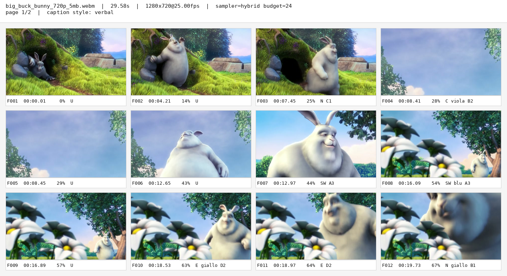
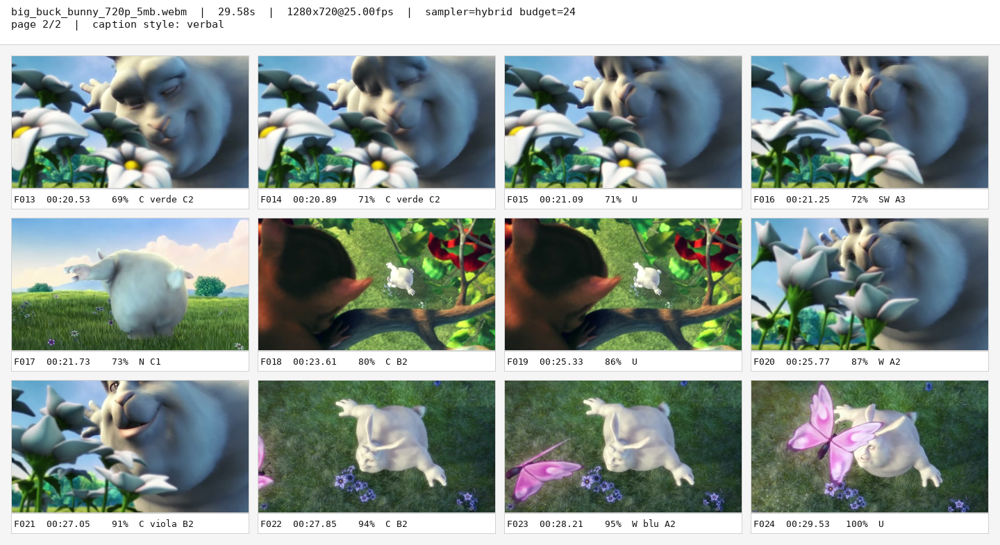
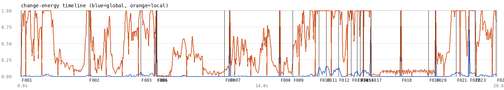
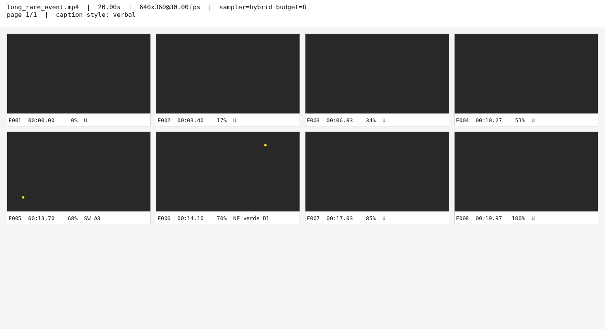
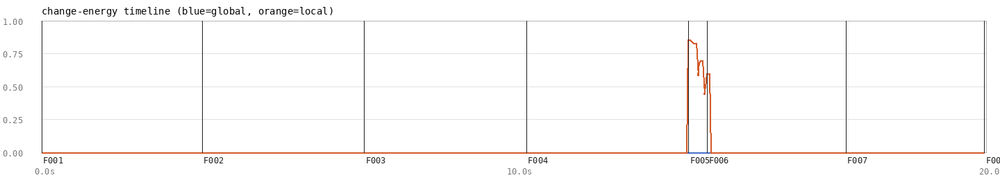
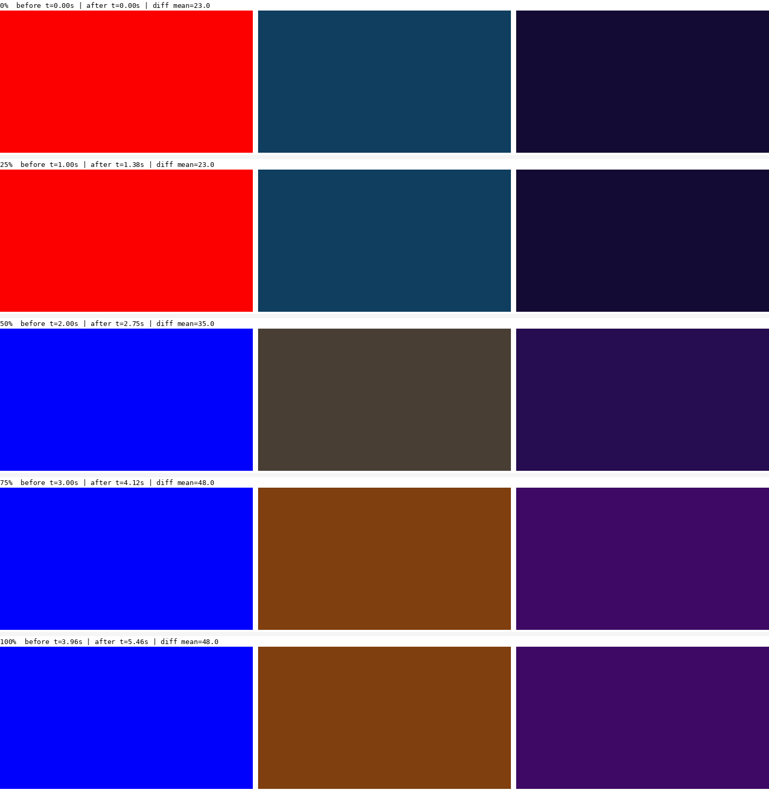
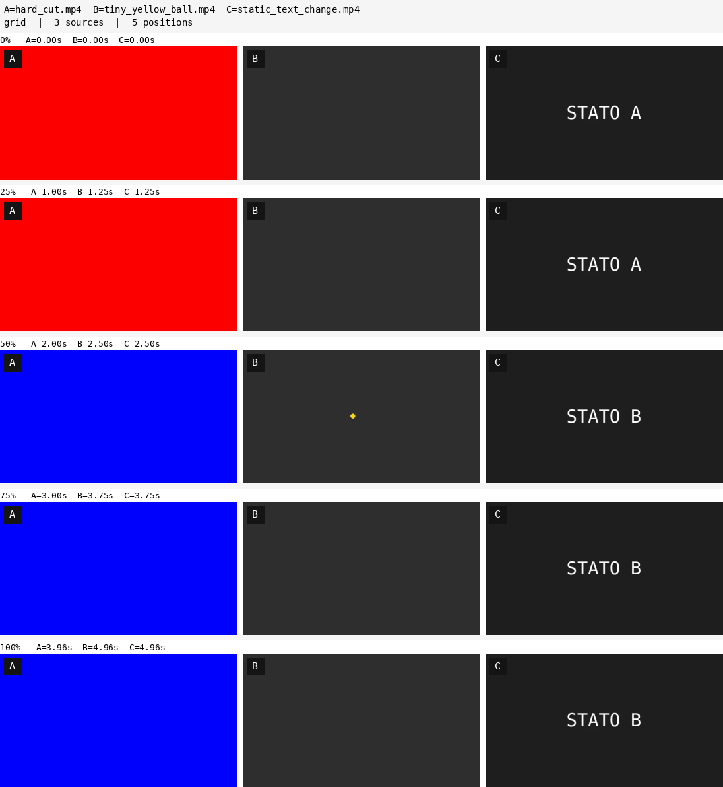

# video-inspect

A deterministic CLI that turns a video (or a directory of frames) into a
compact evidence package an LLM agent — or a human — can understand at a
glance: a captioned contact sheet, a change-over-time plot, JSON
manifest/metrics, and a `zoom` command that goes back to the original
source at full resolution around anything interesting.

No neural networks, no embeddings, no LLM calls in the pipeline. The tool
measures, selects and composes; the reader (human or agent) interprets.

## Why

Most "extract N frames" tools optimize for a *representative* frame. For
debugging and development, that's the wrong target: the frame that matters
is often the rare, small, or brief one — a UI glitch that lasts two frames,
an object that appears for half a second. `video-inspect` samples for
**event coverage under a budget**, not for prettiness: a uniform baseline
guarantees you never miss long stretches, a change-detection channel is
designed to catch short/local events the uniform baseline alone would skip
(how well it does that depends on the footage — see
[Known limitations](#known-limitations)), and a minimum-spacing rule keeps
near-identical event frames from eating the budget.

## Install

```bash
python3 -m pip install numpy opencv-python pillow   # ffmpeg/ffprobe must be on PATH
```

Then run `doctor` (see below) — it tells you exactly what's missing and how
to install it, rather than failing deep inside a run.

## Quickstart

```bash
export PYTHONPATH=src
python3 -m video_inspect doctor

python3 -m video_inspect inspect input.mp4 \
  --output runs/my-run --budget 24 --sampler hybrid

python3 -m video_inspect zoom runs/my-run \
  --frame F007 --cell C2 --window 1.0 --frames 9

python3 -m video_inspect compare before.mp4 after.mp4 \
  --output runs/compare-1
```

`inspect` accepts a video file or a directory of PNG/JPEG frames (pass
`--assume-fps` for the latter if you want timestamps). Every run writes
`manifest.json`, `metrics.json`, `report.md`, one or more `sheet-*.png`,
`timeline.png`, and the selected frames under `frames/`.

### Check your environment

```bash
python3 -m video_inspect doctor
```

Fails clearly (with install instructions) if a **required** component is
missing (`ffmpeg`, `ffprobe`, NumPy, OpenCV, Pillow). For the one
**optional** component (the bundled DejaVu Sans Mono font), it never
crashes — if the font can't be found it falls back to Pillow's built-in
default font and says so, both on screen and in `manifest.json.warnings`.

## Demo: a video I didn't design to flatter the tool

The synthetic test videos below (`test_videos/generate_synthetic.py`) have
exact ground truth and are useful for regression testing, but I built them
myself, so a real-world clip I had no hand in producing is a better check
on whether this actually works. I ran `video-inspect`
against [*Big Buck Bunny*](https://commons.wikimedia.org/wiki/File:Big_buck_bunny_720p_5mb.webm)
(Blender Foundation, CC BY 3.0), 30 seconds, untouched:

```bash
python3 -m video_inspect inspect big_buck_bunny_720p_5mb.webm \
  --output runs/bbb --budget 24 --sampler hybrid
```

<p align="center"></p>
<p align="center"></p>

24 captioned frames tell the story end to end — rabbit leaves the burrow,
looks at the sky, walks to the flowers, a small creature appears on a
branch (`F018`, caught by the local-change channel, not just uniform
coverage), a butterfly closes the scene. Captions read direction + color +
spatial cell (`C giallo D2`, `W blu A2`) straight from measured pixels, not
from a model guessing at the image.

<p align="center"></p>

The timeline is the honest part of this demo: on real, richly textured
footage (grass, leaves, continuous camera motion) the local-change channel
runs hot for long stretches instead of showing isolated spikes like it does
on the clean synthetic corpus. That's a real, documented limitation — see
[Known limitations](#known-limitations) — not swept under the rug.

Two more, on the synthetic corpus (each event's exact timestamp is known,
see `test_videos/generate_synthetic.py`):

<p align="center"></p>

A 0.4-second event inside 20 seconds of near-static video. Uniform
sampling alone misses it entirely at this budget; `hybrid` catches it
*and* still spreads the rest of the budget across the full 20 seconds
(unlike scene-only sampling, which would burn the whole budget on this one
event and show nothing else — see the timeline below).

<p align="center"></p>
<p align="center"></p>

`zoom`, pointed at the right moment with a tight window, re-decodes the
*original* source (never the thumbnail) and crops a small moving object at
full resolution across five frames. It does not track the object — the crop
box is fixed, so this works well with a tight window and gets worse with a
wide one (see [Known limitations](#known-limitations)).

<p align="center"></p>

`compare` does a rough before/after by relative time — before, after, diff
heatmap — useful for spotting where two renders of the same thing diverge.

<p align="center"></p>

`grid` extends the same idea to N videos side by side, purely for
eyeballing — no diff, since with more than two sources doing genuinely
different things a pixel diff has no obvious meaning. Each column is
labeled A/B/C... in a corner badge; useful for comparing several renders of
different scenes, or several encodes of the same source against each other.

## Commands

- `inspect <video|frame-dir> --output DIR [--budget N] [--sampler hybrid|uniform|scene] [--caption-style verbal|codes|none]`
- `zoom <run-dir> --frame F0xx|--at T [--bbox x,y,w,h | --cell C2] [--window S] [--frames N]`
- `compare before after --output DIR [--positions 0,25,50,75,100]`
- `grid video1 video2 [video3 ...] --output DIR [--positions 0,25,50,75,100]`
- `doctor` — environment check (see above)

## Known limitations

- **Local-change thresholds are tuned on the synthetic corpus.** On richly
  textured real footage (grass, leaves, continuous camera motion) they can
  saturate — see the Big Buck Bunny timeline above. Less of an issue on
  cleaner content (UI recordings, flat-background renders).
- **`scene`-only sampling doesn't guarantee coverage**: it can spend the
  whole budget inside one event window and show nothing else. `hybrid`
  reserves a uniform baseline specifically to avoid this.
- **`zoom` doesn't track across its burst** — the crop is fixed to the
  initial bounding box. A fast-moving object can leave a wide crop window;
  use a tighter `--window` centered on the moment you care about.
- `grid` produces one tall image with no pagination — many sources times
  many positions can get unwieldy; keep `--positions` short for a lot of
  videos.
- No live/webcam capture yet — video files and frame directories only.
- No visual region overlay on the contact sheet yet (the direction/color/
  cell descriptor exists in `metrics.json` and in verbal captions, just not
  drawn as a box on the image).
- **`global_change_fraction` only compares each frame to the one
  immediately before it, so a slow, smooth fade or dissolve can stay under
  the per-cell threshold at every single step even though the cumulative
  change is total** (verified: a 1-second black-to-white fade scores
  `0.0000` on every frame). The same blind spot ffmpeg's own adjacent-frame
  scene detector has. A cut or a fast change is still caught reliably; a
  gradual one is not.
- **Zone/color captions need real signal, tunable via `--min-caption-energy`
  (default 0.1).** A frame only gets a color/direction caption when its
  `local_energy` clears this floor; below it, only the plain reason code is
  shown. Measured on a clean, low-noise render: real signal stayed >=0.069,
  noise stayed <=0.018 — a clear gap, and a floor around 0.02-0.03 would
  have used it better (catching a fading event's last frame that 0.1 cuts
  off). The 0.1 default stays conservative anyway: on noisy real-world
  footage (moving grass, continuous camera motion — see the point above)
  `local_energy` sits far higher than that even without a real local event,
  and a single global default hasn't been calibrated across enough content
  types yet to lower it safely for everyone.
- **`manifest.json` records the absolute path of your source file and the
  full command line you ran**, for reproducibility. If you share a run
  directory, review `manifest.json`/`report.md` first — they can contain
  local directory names you may not want to publish.

## Testing

```bash
python3 -m unittest tests.test_video_inspect -v
```

End-to-end tests against ffmpeg-generated fixtures, plus unit tests for the
sampler ranking, direction/cell math, and CLI argument validation.
`tests/eval_recall.py` computes `event_recall@budget` against a ground-truth
JSON file (see `test_videos/generate_synthetic.py` for how to build one).

## License

Code: MIT, see [`LICENSE`](LICENSE). Bundled font (DejaVu Sans Mono):
Bitstream Vera License, see [`fonts/LICENSE-DejaVu.txt`](fonts/LICENSE-DejaVu.txt).
The demo video (*Big Buck Bunny*, Blender Foundation) is CC BY 3.0, not
included in this repository — see [`test_videos/real/SOURCES.md`](test_videos/real/SOURCES.md).
